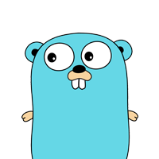
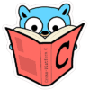

 Author Pablo Pérez García

    
 # Let's GO  
Examples of the most important features of this languages.

In order to follow examples, it's better read from top to bottom of the page.

Is this repo useful? Please ⭑Star this repository and share the love.

### Features
    

* **[Types](features/src/politrons/lang/Types_test.go)**
* **[Collections](features/src/politrons/lang/Collections_test.go)**
* **[Conditions](features/src/politrons/lang/Conditions_test.go)**
* **[Functions](features/src/politrons/lang/Functions_test.go)** 
* **[Methods](features/src/politrons/lang/Methods_test.go)**
* **[Interfaces](features/src/politrons/lang/Interfaces_test.go)**
* **[Error Handling](features/src/politrons/lang/ErrorHandling_test.go)**
* **[Concurrency](features/src/politrons/lang/Concurrency_test.go)**
* **[Pointers](features/src/politrons/lang/Pointers_test.go)**
* **[Context](features/src/politrons/lang/Context_test.go)**

### Monads
    
* **[Maybe](features/src/politrons/monads/Maybe.go)**
* **[Try](features/src/politrons/monads/Try.go)**
* **[Either](features/src/politrons/monads/Either.go)**
* **[Future](features/src/politrons/monads/Future.go)**

### Patterns
    
* **[Dependency Injection & DDD](features/src/politrons/tools/DI)**
* **[Publisher/Subscriber](features/src/politrons/tools/publisherSubscriber/PublisherSubscriberPattern_test.go)**
* **[Functional options](features/src/politrons/tools/functionalOptions/FunctionalOptions_test.go)**
* **[Builder pattern](features/src/politrons/tools/builder/BuilderPattern_test.go)**
* **[Decorator pattern](features/src/politrons/tools/decorator/DecoratorPattern_test.go)**
* **[Observer pattern](features/src/politrons/tools/observer/ObserverPattern_test.go)**
* **[Pattern matching](features/src/politrons/tools/patternMatching/PatternMatching_test.go)**
* **[Strategy](features/src/politrons/tools/Strategy_test.go)**
* **[Circuit breaker](features/src/politrons/tools/failFast/CircuitBreaker_test.go)**

### Connectors
    
* **[Rest](features/src/politrons/tools/connectors/HttpClient_test.go)**
* **[Cassandra](features/src/politrons/tools/connectors/Cassandra_test.go)**
* **[Kafka](features/src/politrons/tools/connectors/Kafka_test.go)**
* **[gRPC](features/src/politrons/tools/rpc/README.md)**

### Programs
    

* **[Customer order service](programs/basket/README.md)**
* **[Communications](programs/comunications)**
* **[Who is watching](https://github.com/politrons/Who-is-watching)**

### Kubernetes
    

Examples of Kubernetes Operators, that use [Go client](https://github.com/kubernetes/client-go) for talking to a kubernetes cluster.

Each operator is divide in the **Operator_test** that run the test and the **Controller** with the extended methods that interact with K8s API

* **[Namespace operator](features/src/politrons/tools/k8/namespace)**
* **[Pod operator](features/src/politrons/tools/k8/pod)**
* **[Role Binding operator](features/src/politrons/tools/k8/role)**

### GraphQL
    

Example of IMDb service implemented using [GraphQL](https://graphql.org/learn/) 

* **[Server](features/src/politrons/tools/graphql/Imdb_test.go)**

You can run the test scenario and then make some queries like 

```
curl -g 'http://localhost:12345/imdb?query={actors(movie:"Matrix"){name,age}}'
curl -g 'http://localhost:12345/imdb?query={actors(movie:"Fight_club"){name,age}}'
```

### Vegeta Performance 
    

Example of performance test using this awesome library 
* **[Over 9000!](features/src/politrons/performance/Over9000_test.go)**
