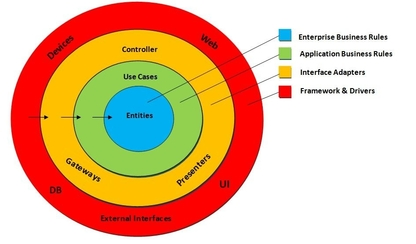

    
 # Dependency Injection & DDD
 
Examples of how this Dependency Inject0976 pattern works on Golang together with DDD architecture.

* **[Application](application/MainApplication_test.go)**
* **[Domain](domain/EntityAgregateRoot.go)**
* **[Repository](infrastructure/Repository.go)**
* **[DAO](infrastructure/DAO.go)**