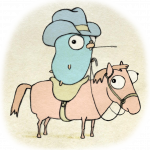

#       

# Communications

An example of how three services, can communicate between each other using `Rest` `gRPC` and `Kafka`.

The sources of the program:

* **[Rest](src/rest)**
* **[Kafka](src/kafka)**
* **[gRPC](src/gRPC)**

The runner class [here](src/CommunicationRunner_test.go)

The flow of the program
````
Client ---> [REST request] ---> [KAKA PUBLISHER] ---> [KAFKA CONSUMER] ---> [gRPC CLIENT]

       ---> [gRPC SERVER]  ---> [KAKA PUBLISHER] ---> [KAFKA CONSUMER] ---> [REST response] ---> Client
````

If the client make an Http request into:

```
http://localhost:4000//communication/restKafkaGRPC/
```

The logs of the transaction show:

```
REST request: hello world from rest 
KAFKA Publisher: hello world from rest and Kafka publisher 
KAFKA Consumer: hello world from rest and Kafka publisher and Kafka consumer 
gRPC Client:hello world from rest and Kafka publisher and Kafka consumer and gRPC client 
gRPC Server:hello world from rest and Kafka publisher and Kafka consumer and gRPC client and gRPC server 
KAFKA Publisher: hello world from rest and Kafka publisher and Kafka consumer and gRPC client and gRPC server and Kafka publisher 
KAFKA Consumer: hello world from rest and Kafka publisher and Kafka consumer and gRPC client and gRPC server and Kafka publisher and Kafka consumer 
REST response: hello world from rest and Kafka publisher and Kafka consumer and gRPC client and gRPC server and Kafka publisher and Kafka consumer 
############################################################################################
End of transaction with Message:
HELLO WORLD FROM REST AND KAFKA PUBLISHER AND KAFKA CONSUMER AND GRPC CLIENT AND GRPC SERVER AND KAFKA PUBLISHER AND KAFKA CONSUMER
############################################################################################

```

The response to the client show:

```
"HELLO WORLD FROM REST AND KAFKA PUBLISHER AND KAFKA CONSUMER AND GRPC CLIENT AND GRPC SERVER AND KAFKA PUBLISHER AND KAFKA CONSUMER"
```